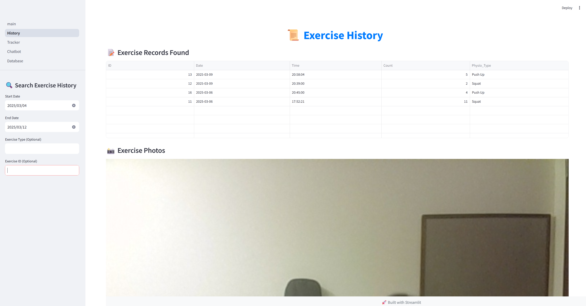
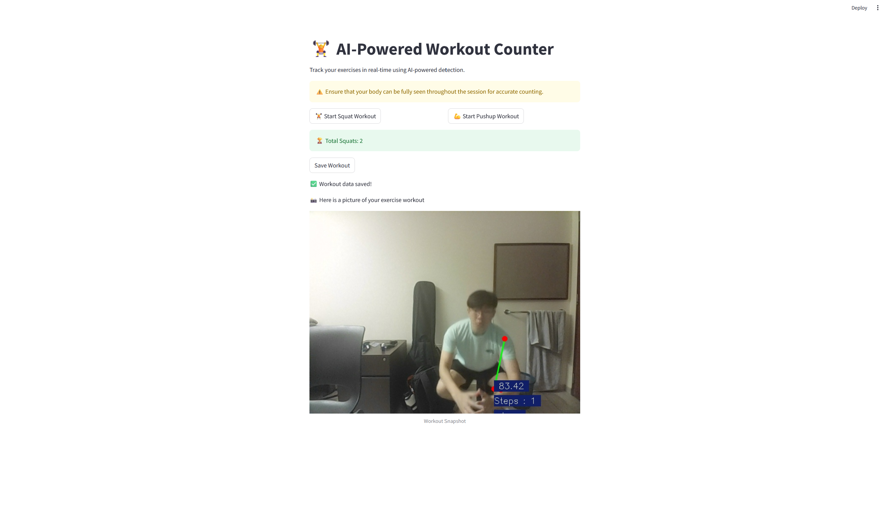
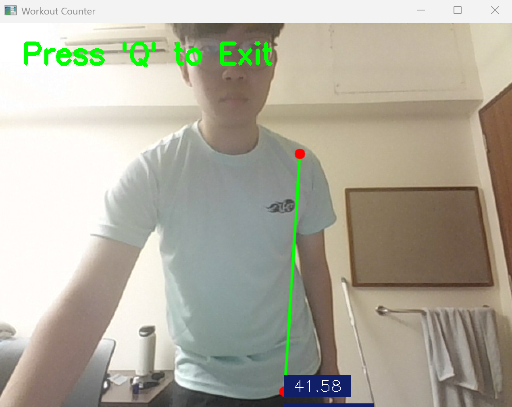
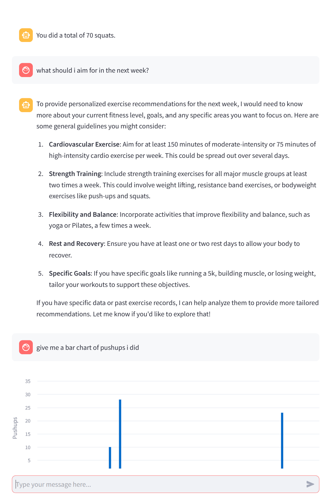
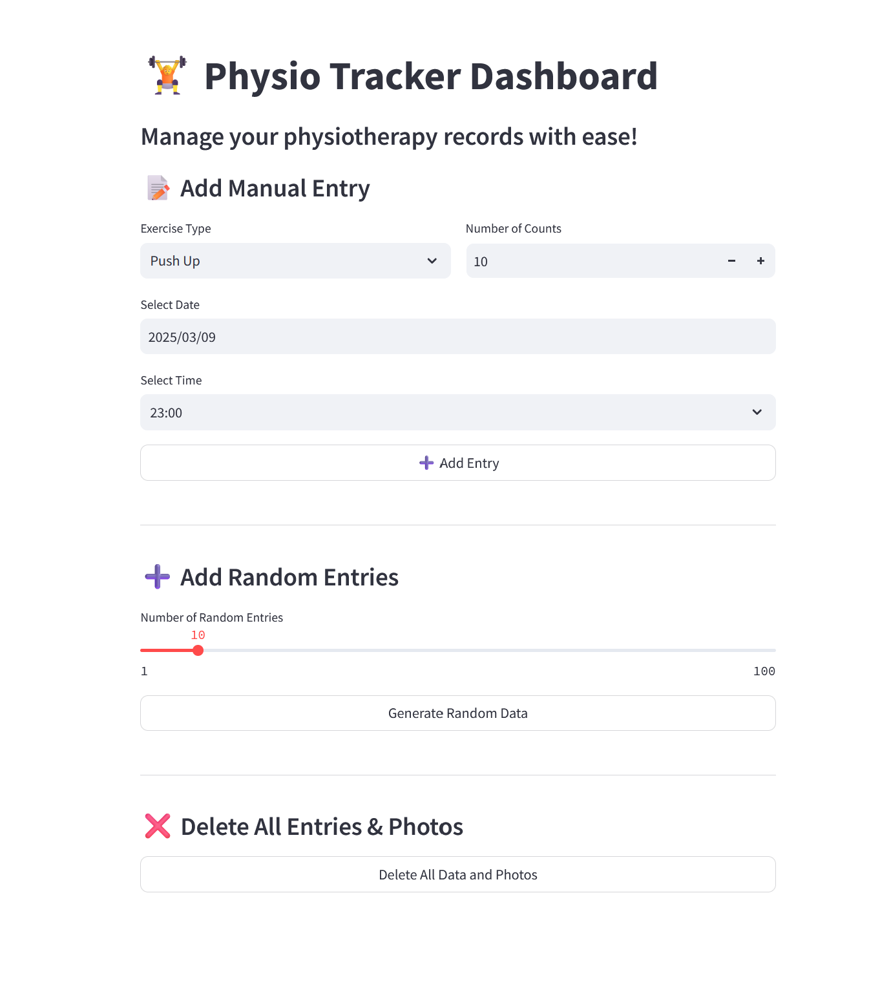

# cv-exercise

cv-exercise is a computer vision-powered fitness tracking app built with Streamlit. It uses OpenCV for computer vision, YOLO for model tracking, langchain for LLM RAG and SQLite3 for data storage. The app helps users track push-ups and sit-ups while providing insights, historical data, and chatbot interaction.

## Features

### 1. **Main Page**
   - View your exercise stats and progress.
   - Graph visualization of your workouts.
   - AI-powered recommender bot provides feedback on your performance.

   

### 2. **History Page**
   - Search for specific exercise entries.
   - View photos of past workout sessions.
   - Option to delete selected entries.

   

### 3. **Tracker Page**
   - Log push-up or squat sessions.
   - The model tracks and counts repetitions in real-time.
   - Saves session photos for reference.

   
   

### 4. **Chatbot Page**
   - Interactive chatbot to answer questions about your exercise history.
   - Provides general exercise advice.

   

### 5. **Database Page**
   - Manually log workout entries.
   - Generate random data entries (for testing and development).
   - Delete entries if needed.

   

## Installation

1. Clone the repository:
   ```bash
   git clone https://github.com/your-username/cv-exercise.git
   cd cv-exercise
   ```

2. Install dependencies:
   ```bash
   pip install -r requirements.txt
   ```

3. Run the app:
   ```bash
   streamlit run main.py
   ```

## Technologies Used
- **Streamlit**: For UI and display.
- **OpenCV**: Computer vision tracking.
- **YOLO**: Model tracking for exercise counting.
- **Langchain**: Use for Retrieval Augmented Generation with OpenAI.
- **SQLite3**: Data storage and management.

## Contributions
Contributions are welcome! Feel free to fork the repo and submit pull requests.


